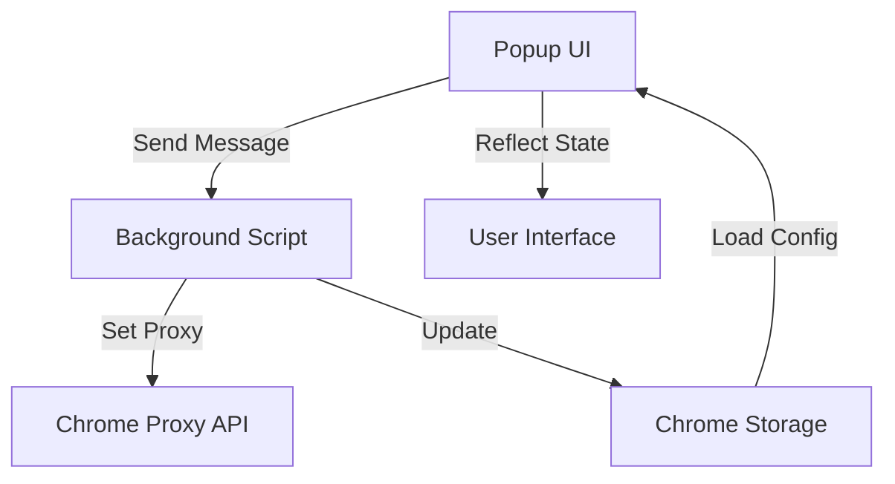

# 🧩 Burp Suite Connect

> **A powerful, open-source browser extension to connect Chrome or Firefox with Burp Suite proxy — seamlessly.**


---

## 🚀 Overview

**Burp Suite Connect** is a simple yet robust browser extension that lets you easily connect your browser’s traffic through **Burp Suite Proxy**.  
It provides an elegant interface for toggling proxy on/off, customizing host and port, and ensuring your network debugging workflow remains frictionless across **Chrome** and **Firefox**.

This project is **100% open-source**, designed with **developers, testers, and cybersecurity professionals** in mind.

---

## ✨ Key Features

| Feature | Description |
|----------|-------------|
| 🔌 **Quick Connection Toggle** | Enable or disable Burp Suite proxy instantly from the popup. |
| ⚙️ **Customizable Settings** | Configure proxy host and port directly in the extension UI. |
| 🔄 **Persistent Configuration** | Your last-used configuration is saved automatically using Chrome Storage. |
| 🖼️ **Dynamic Icon Updates** | Visual icon feedback shows current connection status (on/off). |
| 🧠 **Smart Validation** | Built-in validation prevents invalid host or port entries. |
| 🔐 **Local-Only** | No data leaves your device — privacy-first design. |

---

## 🧰 Tech Stack

| Layer | Technology |
|--------|-------------|
| **Frontend** | HTML5, CSS3, Vanilla JavaScript |
| **Backend (Service Worker)** | Chrome/Firefox Extension API |
| **Storage** | Chrome Storage API |
| **Infrastructure** | Browser Runtime Environment |

---

## 📁 Project Structure

```
burp-suite-connect/
│
├── manifest.json           # Extension configuration (v3)
├── background.js           # Core logic for proxy management
├── popup.html              # UI for connection settings
├── popup.js                # Frontend logic for user interaction
└── icons/                  # On/Off status icons
```

---

## ⚙️ How It Works

1. **Load Configuration**
   - The extension retrieves stored host, port, and status from `chrome.storage.local`.
2. **Toggle Proxy**
   - When “Connect” is clicked, it enables a `fixed_servers` proxy configuration using your provided host/port.
3. **Update Icon**
   - Automatically changes to a green “ON” icon or a gray “OFF” icon.
4. **Sync UI**
   - Status and button text in the popup update dynamically via `chrome.runtime` messages.

---

## 🖥️ Installation Guide

### 🔹 For Developers (Manual Install)

#### Chrome
1. Open **chrome://extensions/**
2. Enable **Developer Mode**
3. Click **Load unpacked**
4. Select the project directory containing `manifest.json`

#### Firefox
1. Open **about:debugging#/runtime/this-firefox**
2. Click **Load Temporary Add-on**
3. Choose `manifest.json`

---

## 💡 Usage

1. Click the extension icon in your toolbar.  
2. Enter your Burp Suite **Host** (default: `127.0.0.1`) and **Port** (default: `8080`).  
3. Click **Connect**.  
4. Your browser traffic now routes through Burp Suite.  
5. Click **Disconnect** anytime to restore normal browsing.

---

## 🔒 Permissions Explained

| Permission | Purpose |
|-------------|----------|
| `proxy` | To control browser proxy settings for routing traffic |
| `storage` | To persist user preferences (host, port, enabled state) |
| `activeTab` | To allow communication between popup and background scripts |

---

## 🧪 Development

### Run Locally
```bash
git clone https://github.com/AK-ALiEN/BurpSuite-Connector.git
cd BurpSuite-Connector
# Edit the files and reload your extension
```

### Testing (Manual)
1. Run Burp Suite locally (default `127.0.0.1:8080`)
2. Open your extension popup
3. Connect, then visit any website
4. Confirm traffic appears in Burp Suite → Proxy → HTTP history

---

## 📊 Architecture Diagram



---

## 🧩 Example Code Snippets

<details>
<summary>Background Script (proxy setup)</summary>

```js
const proxyConfig = {
  mode: "fixed_servers",
  rules: {
    singleProxy: {
      scheme: "http",
      host: config.host,
      port: parseInt(config.port)
    },
    bypassList: ["localhost", "127.0.0.1"]
  }
};
await chrome.proxy.settings.set({ value: proxyConfig, scope: 'regular' });
```
</details>

<details>
<summary>Popup Script (toggle button)</summary>

```js
connectButton.addEventListener('click', async function() {
  const result = await chrome.runtime.sendMessage({ action: 'toggleProxy' });
  if (result.success) {
    currentConfig = result.config;
    updateUI();
  }
});
```
</details>

---

## 🧑‍💻 Developer

**Author:** [ALiEN](https://t.me/ak_xlien)  
**Maintainers:** [AlienDevLab](https://t.me/AlienDevLab) 
**Version:** 1.0.2  
**License:** [MIT License](LICENSE.txt)

---

## 📈 Future Roadmap

- [ ] Support for HTTPS proxy configuration  
- [ ] Auto-detection of active Burp Suite instance  
- [ ] Browser synchronization (Chrome ⇄ Firefox)  
- [ ] Light/Dark popup themes  
- [ ] Multi-profile proxy management  

---

## 🧾 License

This project is licensed under the **MIT License** — see the [LICENSE](LICENSE.txt) file for details.

---

## 🤝 Contributing

Contributions, issues, and feature requests are welcome!  
Feel free to open a PR or start a discussion.

### Workflow
1. Fork the repository  
2. Create a new branch (`feature/my-feature`)  
3. Commit your changes  
4. Push and open a Pull Request  

---

## 🌍 Community & Support

- 📘 [Official Docs (Coming Soon)](https://github.com/AK-ALiEN/BurpSuite-Connector/wiki)
- 💬 [Discussions](https://github.com/AK-ALiEN/BurpSuite-Connector/discussions)
- 🧠 [Report Bug / Suggest Feature](https://github.com/AK-ALiEN/BurpSuite-Connector/issues)

---

> _Burp Suite Connect — Simplifying your proxy workflow for better security testing._
